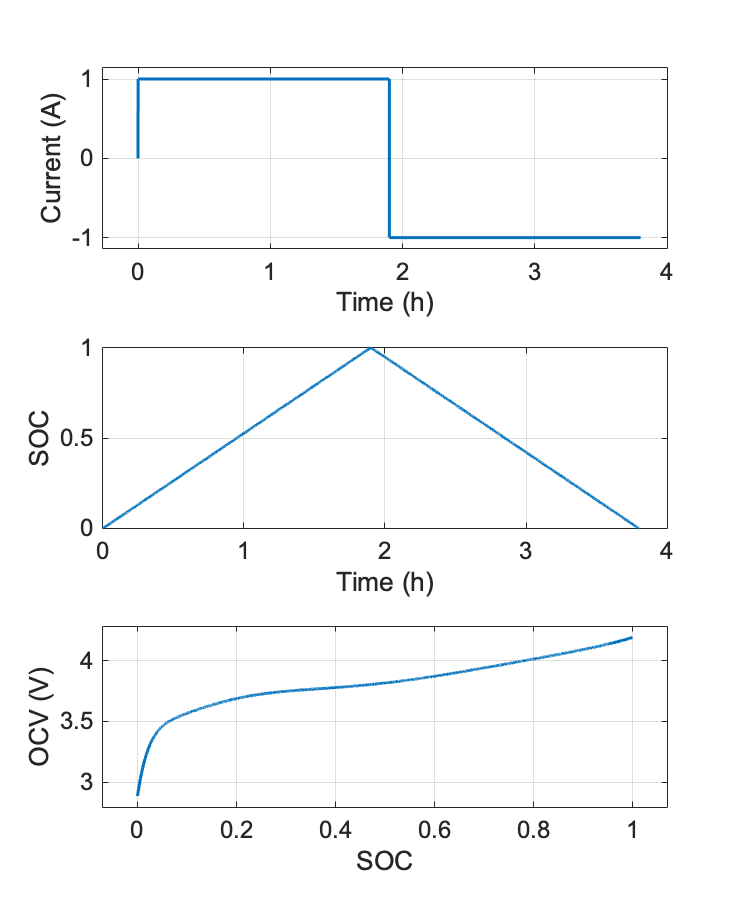

# battery-state-of-charge

```
battery_simulator.m
```
<p align="center">
 
</p>

**References:**  
[1]. Ahmed, Mostafa Shaban, Sheikh Arif Raihan, and Balakumar Balasingam. "A scaling approach for improved state of charge representation in rechargeable batteries." Applied energy 267 (2020): 114880.
