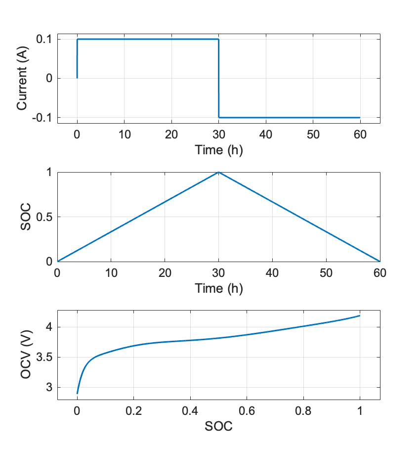

# Battery state-of-charge (SOC) estimation

### Table of Contents
0. [Battery simulation](#Battery-simulation)
1. [SOC estimation using coulomb counting](#SOC-estimation-using-coulomb-counting)
2. [SOC estimation using open-circuit voltage (OCV) lookup ](#Dependencies)
3. [SOC estimation using the extended Kalman filter (EKF)](#Build)
4. [Comparision of coulomb counting, OCV, and EKF](#How-to-run)
5. [More Related Work](#More-Related-Work)
6. [Frequently Asked Questions](#Frequently-Asked-Questions)
7. [License](#License)

Battery simulation
``` 
BatteryDEMO.m
```

