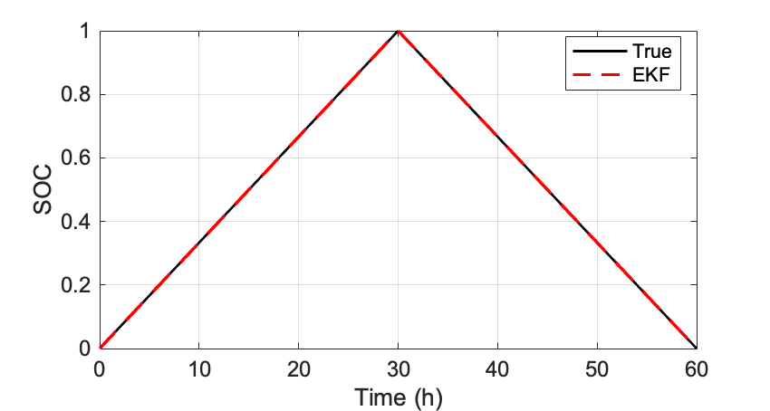

# Battery state-of-charge (SOC) estimation using the extended Kalman filter (EKF).

Simulate battery,
```
BatteryDEMO.m
```


Coulomb counting for SOC estimation, 
```
CoulombCountingDEMO.m
```
Open-circuit voltage lookup for SOC estimation, 
```
OpenCircuitLookupDEMO.m
```
Extended Kalman filter for SOC estimation, 
```
ExtendedKalmanFilterDEMO.m
```


For more details or if you use the code for any academic work, please cite the original paper.

```bibtex
coming soon ....
```
